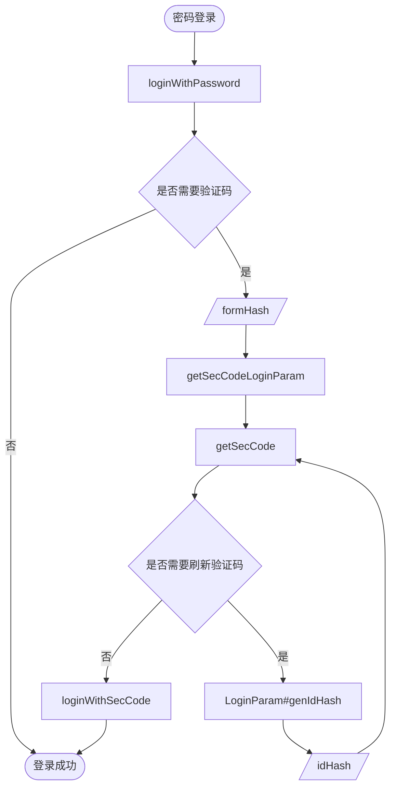
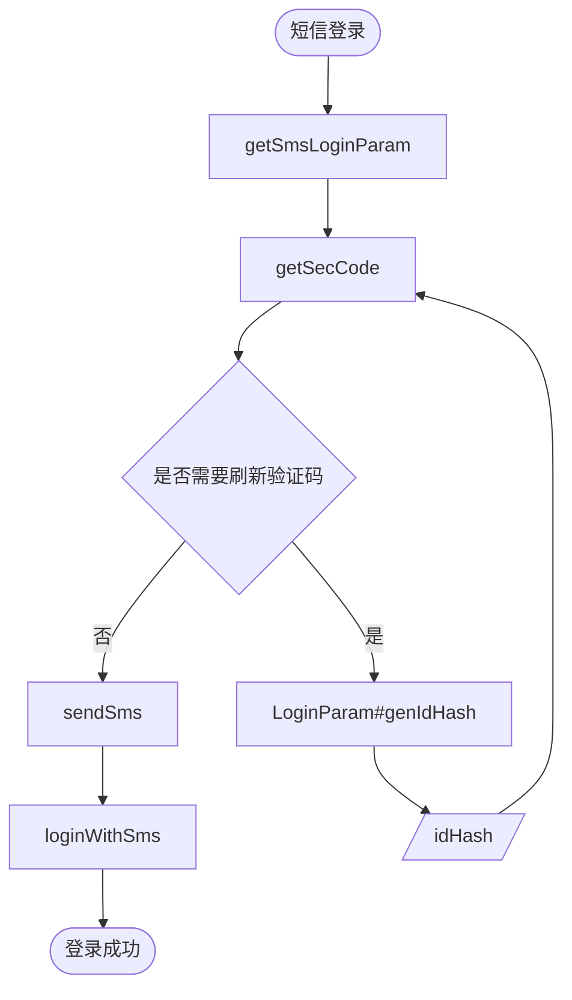

# [其乐](https://keylol.com) API 

调用Discuz mobile接口,没有相应接口的页面通过爬取网页实现

## API 列表

|方法|说明|
|-|-|
|getSmsLoginParam|获取短信登录所需参数,如短信发送所需图形验证码,验证码发送以及验证码登录|
|getSecCodeLoginParam|密码登录有时需要图形验证码,此时调用此接口获取登录用参数,如图形验证码以及登录|
|getSecCode|获取图形验证码,短信登录和密码登录需要的验证码均使用此接口|
|checkSecCode|预校验图形验证码|
|sendSms|发送短信验证验证码|
|loginWithSms|短信验证码登录|
|loginWithPassword|密码登录,可能会登录失败根据失败类型判断是否需要图形验证码|
|loginWithSecCode|密码登录需要图形验证码时调用此接口登录|
|index|获取主页帖子，轮播图和分组帖子|
|viewThread|查看帖子及回复|
|checkPost|检查权限，发帖回复及文件上传限制|
|forumUpload|文件上传|
|sendReply|回复帖子|
|pollVote|投票|
|forumIndex|版块索引，版块分类以及分类下版块|
|forumDisplay|版块帖子，包含版块信息及子版块|

## 登录流程

### 密码登录

### 短信登录

